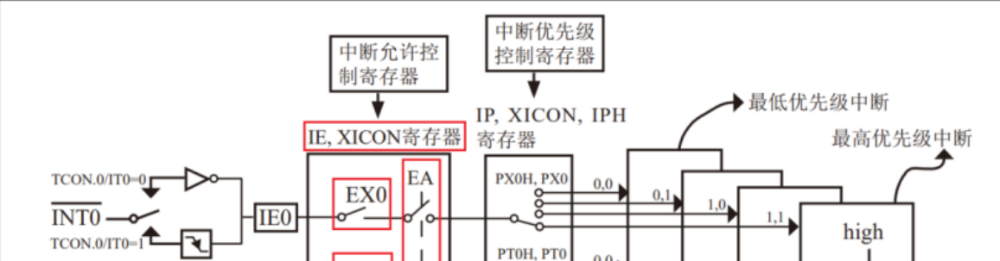
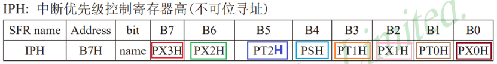
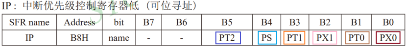
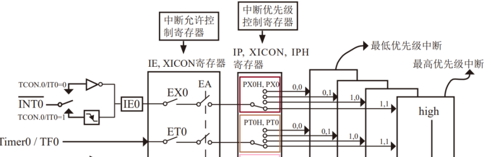
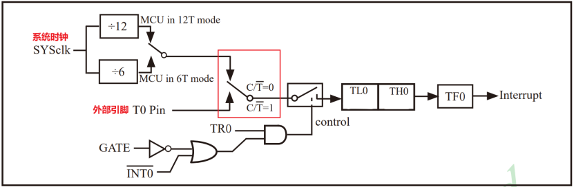
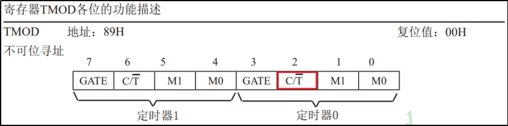

## 第12章 中断

### 12.1 概述

```
1. 中断源
2. 中断标志位
3. 中断服务程序
4. 中断优先级
```

### 12.2 中断源

<table style="">
<thead>
	<tr style="background:#3C4244;color:#fff;">
		<th width="20%">中断类型</th>
		<th width="10%">数量</th>
		<th width="20%">名称</th>
		<th width="20%">中断号</th>
		<th width="30%">对应引脚</th>
	</tr>
</thead>
<tbody>
	<tr style="background:#CAB08F">
		<td rowspan="4">外部中断</td>
		<td rowspan="4">4</td>
		<td>INT0</td>
		<td>0</td>
		<td>P32</td>
	</tr>
	<tr style="background:#CAB08F">
		<td>INT1</td>
		<td>2</td>
		<td>P33</td>
	</tr>
	<tr style="background:#CAB08F">
		<td>INT2</td>
		<td>6</td>
		<td>P43</td>
	</tr>
	<tr style="background:#CAB08F">
		<td>INT3</td>
		<td>7</td>
		<td>P42</td>
	</tr>
    <!-- -------  -->
    <tr style="background:#FEB58C;">
		<td rowspan="3">定时器中断</td>
		<td rowspan="3">3</td>
		<td>Timer0</td>
		<td>1</td>
		<td>P34(脉冲源)、P32(开始计数)</td>
	</tr>
	<tr style="background:#FEB58C;">
		<td>Timer1</td>
		<td>3</td>
		<td>P35(脉冲源)、P33(开始计数)</td>
	</tr>
	<tr style="background:#FEB58C;">
		<td>Timer2</td>
		<td>5</td>
		<td></td>
	</tr>
    <!-- -------  -->
    <tr style="background:#AFD4C4;">
		<td>串口中断</td>
		<td>1</td>
		<td></td>
		<td>4</td>
		<td></td>
	</tr>
</tbody>
</table>

```
INT0	0
Timer0	1
INT1	2
Timer1  3
串口	   4
Timer2  5
INT2    6
INT3    7
```

### 12.2 中断服务程序

```c
void 函数名 interrupt 中断号
{
    代码...
}
例1:外部中断0
void INT0Handler() interrupt 0{
    
}
例2:定时器中断0
void Timer0Handler() interrupt 1{
    
}
```

### 12.3 中断优先级

```
1. 每个中断可以设置 0 ~ 3 4个优先级等级，如果多个中断同时触发，CPU先处理优先级高的中断，数字越大优先级越高
2. 如果同时触发的多个中断优先级相同，按照中断号，越小越先处理
```


## 第13章 外部中断 — 按键控制LED亮灭

### 外部中断实现步骤：

#### ① 启动中断

**总控制位：**

```
IE寄存器的EA位，置1允许中断
```

**4个外部中断控制位：**

```
INT0：IE寄存器中的EX0位，置1允许中断
INT1：IE寄存器中的EX1位，置1允许中断
INT2：XICON寄存器中的EX2位，置1允许中断
INT3：XICON寄存器中的EX3位，置1允许中断
```



```c
// 下面都以外部中断0(INT0)为例:
// 打开中断总开关
EA = 1;
// 使能外部中断0(INT0)
EX0 = 1;
```

#### ② 配置中断触发方式


```
INT0：TCON寄存器中的IT0位
INT1：TCON寄存器中的IT1位
INT2：XICON寄存器中的IT2位
INT3：XICON寄存器中的IT3位
```

```c
// 设置为0表示低电平触发，设置为1表示下降沿触发
IT0 = 0;
```

#### ③ 配置中断优先级

```
INT0: IPH寄存器中的PX0H位、IP寄存器中的PX0位
INT1: IPH寄存器中的PX1H位、IP寄存器中的PX1位
INT2: IPH寄存器中的PX2H位、XICON寄存器中的PX2位
INT3: IPH寄存器中的PX3H位、XICON寄存器中的PX3位
```

```
1. 每个中断支持4个优先级，故每个中断需要两个优先级控制位。
2. 高位和低位会放在不同的寄存器中。
```





```c
// 设置外部中断0优先级
// 高优先级 1,1:为最高优先级
PX0 = 1; // 外部中断0设置为高优先级
IPH = 0x01; // 设置中断优先级寄存器高字节，外部中断0高优先级
```

> **注意：** IPH 寄存器不可位寻址。

#### ④ 定义中断服务程序

```c
void 函数名 Interrupt 中断号
{
    代码....
}

```

```C
// 外部中断0 中断服务程序
void INT0Handler() interrupt 0{
    
}
```


## 第13章 定时器中断：

### 定时器中断实现步骤

#### ① 启用定时器中断

```
Timer0：IE寄存器中的ET0位
Timer1：IE寄存器中的ET1位
Timer2：IE寄存器中的ET2位
```

```c
// 以下都有 定时器0(Timer0) 为例:
// 打开中断总开关
EA = 1;
// 打开定时器0中断开关
ET0 = 1;
```



#### ② 选择定时器脉冲来源和工作模式

**选择脉冲来源：**

```
Timer0：TMOD寄存器中的 C/T(位置2) 位。
Timer1：TMOD寄存器中的 C/T(位置6) 位。
```





```c
// 设置为0：定时方式，脉冲信号是系统时钟
// 设置为1：计数方式，脉冲信号是外部引脚
// 选择定时器脉冲来源[C/T#]和工作模式[M1,M0]->寄存器TMOD中设置[不可位寻址]
// 把TMOD寄存器的低四位清零,其他位不变
    TMOD &= 0xF0; // 清除TMOD寄存器的低四位 [TMOD & 1111 0000]
// 设置TMOD寄存器的低四位为0001 0[GATE:决定是否受外部中断0(INT0)的影响] 0[C/T#:使用单片机内部时钟]      01[工作模式1:16位脉冲计数器]
    TMOD |= 0x01; // 设置TMOD寄存器的低三位为0001 
```

> **注意：** TMOD 寄存器不可位寻址。

**选择工作模式：**

```
Timer0：TMOD寄存器的2位、1位；TL0寄存器、TH0寄存器
Timer1：TMOD寄存器的5位、4为；TL1寄存器、TH1寄存器
```

```
模式0: 13位定时/计数器，TL0(5bits)+TH0(8bits)
模式1: 16位定时/计数器，TL0(8bits)+TH0(8bits)
模式2: 8位自动重装载，TL0计数，TH0是初始值； TL0溢出后，将TH0的数字载入再次计数
模式3：双8位定时/计数器，TL0和TH0分别计数。
```

> **注意：** TMOD、 TL0、TH0、TL1、TH1  寄存器不可位寻址。

#### ③ 设置脉冲计数器初始值

```
1. 计算每个计数脉冲的时间
2. 计算所需脉冲个数
3. 计算脉冲计数器初始值
```

```c
// 当前系统的时钟频率为11.0592MHz，也就是11059200Hz，所以计数脉冲的频率是11059200/12 Hz，
// 因此一个计数脉冲的时间是12/11059200 s，大约是1.08us。
// 现在需要定时1ms，那么1ms需要的脉冲个数应为0.001/(12/11059200)。 
// 工作模式1（16位）溢出值:2^16=65536
 // 设置定时器初值 65536 - 0.001 / (12 / 11059200)  = 64614
 // 需要把整个初值给TL0[低8位]和TH0[高8位]寄存器
 // 从而使得定时器0每1ms产生一次中断 64614-->65536
    TL0 = 64614; // 设置定时器0的低8位初值
    TH0 = 64614 >> 8; // 设置定时器0的高8位初值
```

#### ④ 设置定时器中断优先级

````
Timer0：IPH寄存器中的PT0H位、IP寄存器中的PT0位
TImer1：IPH寄存器中的PT1H位、IP寄存器中的PT1位
Timer2：IPH寄存器中的PT2H位、IP寄存器中的PT2位
````

```c
// 4种优先级 选一个
PT0H=0; PT0=0;	//低优先级
PT0H=0; PT0=1;
PT0H=1; PT0=0;
PT0H=1; PT0=1;  //高优先级
```

#### ⑤ 启动定时器（开始计数）

**GATE控制位：**

```
Timer0: TMOD寄存器中的 3 位
Timer1: TMOD寄存器中的 1 位
```

**外部控制引脚：**

```
Timer0：INT0/P32
TImer1：INT1/P33
```

**TR控制位：**

```
Timer0：TCON寄存器中的 TR0 位
Timer1：TCON寄存器中的 TR1 位
```

```c
// 启动定时器0,开始计数
// 当GATE=0[TMOD寄存器中]时,外部引脚(INT0)不影响定时器的工作
TR0 = 1; // 启动定时器0,开始计数
```

**规则：**

```
GATE为0：
	INT0不影响定时器0
	TR0=1开始计数，TR0=0停止计数

GATE为1：
	外部中断0触发并且TR0为1时才开始计数
```

#### ⑥ 定义中断服务程序

```c
void 函数名 Interrupt 中断号
{
    代码....
}
void Timer0_Handler() interrupt 1{
    
}
```


## 附录

### 寄存器名称

**IE：**Interrupt Enable，中断允许寄存器。

**XICON：**Auxiliary Interrupt Control，辅助中断控制寄存器。  

**TCON：** Timer/Counter 0 and 1 Control，定时器/计数器中断控制寄存器。  

**T2CON：**Timer/Counter 2 Control，定时器/计数器2控制寄存器。  

**SCON：** Serial Control，串口控制寄存器。

**IP：**Interrupt Priority Low，中断优先级控制寄存器（低位）。

**IPH：**Interrupt Priority High，中断优先级控制寄存器（高位）。

**TMOD：**Timer Mode，定时器模式寄存器。  

### 中断相关单词

```
interrupt：中断
enable: 允许
external：外部
timer：定时器
serial：串行
Auxiliary： 辅助
control：控制
priority：优先级
trigger：触发
```

### 51扩展板引脚参考

| 引脚                   | 对应模块                               |
| ---------------------- | -------------------------------------- |
| P00 ~ P01              | 流水灯 /  数码管段选                   |
| P13 ~ P15              | 数码管位选                             |
| P20 ~ P23				 | 矩阵按键 1 ~ 4 行	|
| P24 ~ P27					|矩阵按键 1 ~ 4 列 					|
| P32                    | 独立按键SW3 / 外部中断0 / Timer0计数启动  |
| P33                    | 独立按键SW4 / 外部中断1 / Timer1计数启动  |
| P34                    | 流水灯开关(1开) /  Timer0脉冲源     |
| P35 | Timer1脉冲源 |
| P36                    | 数码管开关(0开)                  |
| P42 				| 独立按键SW1 / 外部中断3     |
| P43 | 独立按键 SW2 / 外部中断2 |
| P46                    | 蜂鸣器                                 |

### 用户代码片段

```json
"C C++ Header": {
    "prefix": "header",
    "description": "Add #ifndef, #define and #endif",
    "body": [
        "#ifndef __${TM_FILENAME_BASE/(.*)/${1:/upcase}/}_H__",
        "#define __${TM_FILENAME_BASE/(.*)/${1:/upcase}/}_H__",
        "",
        "$0",
        "",
        "#endif /* __${TM_FILENAME_BASE/(.*)/${1:/upcase}/}_H__ */"
    ]
}
```

